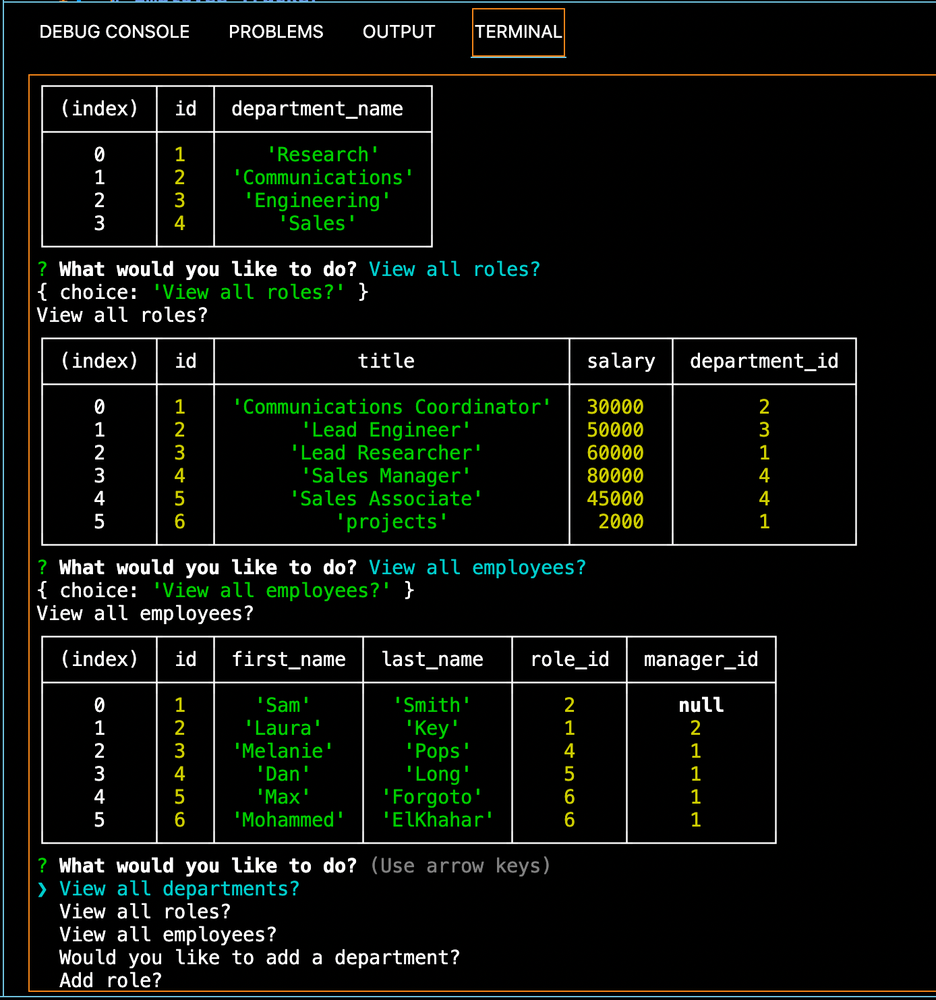

# Employee Tracker

## Table of Contents

---

- ## [Description](#Description)
- ## [Installation](#Installation)
- ## [Usage](#usage)
- ## [Contributors](#Contributors)
- ## [License](#License)
- ## [Username](#Username)
- ## [Email](#Email)

---

## Description

A backend app that allows a business own to view all departments, roles and employess. It also allows the user to add roles, employees and update employee information.

## Installation

npm i in the terminal to install MySQL2, Inquirer and console.table

## Usage

In the command-line "npm start" or "node server.js" to view and input data

## Contributors

Bianca Chami

---

## License

---

## Username

chamibia

## Email

bischami@gmail.com

## Preview:

